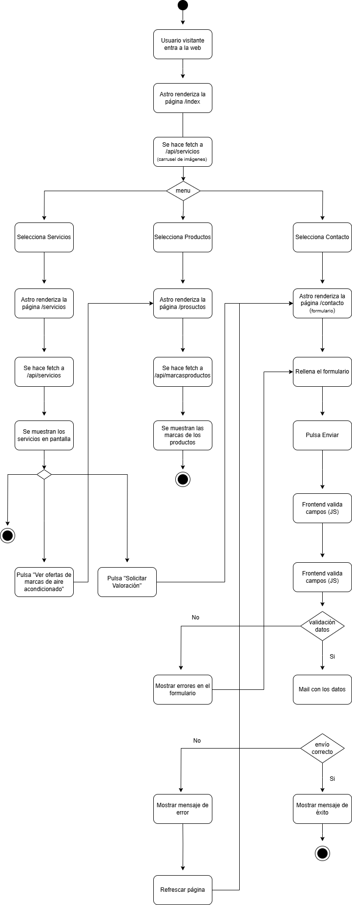

 

 
 

El **diagrama de actividad** representa las funcionalidades básicas disponibles para cualquier usuario no registrado (visitante) en la plataforma. Al acceder a la página principal, el visitante puede navegar libremente por tres secciones principales: Servicios, Productos y Contacto.

En la sección de **Servicios**, el sistema realiza una petición a la API correspondiente para mostrar un carrusel de imágenes y luego renderiza la lista de servicios disponibles. En algunos casos, se ofrece al visitante la opción de ver ofertas específicas, como las relacionadas con marcas de aire acondicionado.

En la sección de **Productos**, el visitante puede visualizar las diferentes marcas disponibles, tras una petición a la API de marcas. También tiene la posibilidad de solicitar una valoración sin necesidad de iniciar sesión.

En la sección de **Contacto**, el visitante puede rellenar un formulario que es validado por el frontend. Si los datos ingresados son válidos, se envía un correo con la información; de lo contrario, se muestran mensajes de error. En ambos casos, se le proporciona retroalimentación al usuario sobre el estado del envío.

Estas funcionalidades están disponibles sin necesidad de autenticarse en el sistema, permitiendo una navegación abierta e informativa para cualquier usuario visitante.