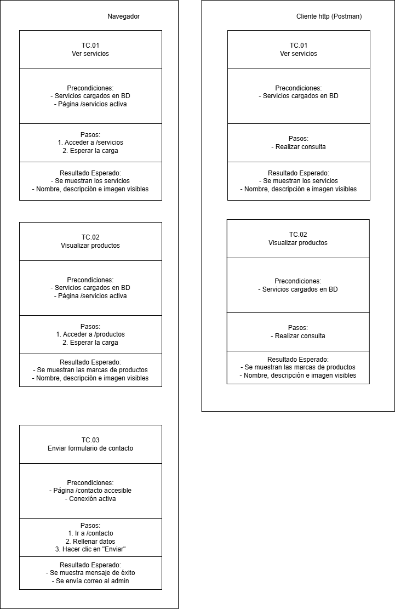

 

 
 
### 🧪 Casos de Prueba

El diagrama de **casos de prueba** detalla los escenarios principales que se evalúan para verificar el correcto funcionamiento de la plataforma desde dos perspectivas: mediante el **navegador web** y a través de un **cliente HTTP como Postman**. Cada caso define las condiciones previas necesarias, los pasos a seguir y el resultado esperado. Estos casos están orientados a usuarios no autenticados y validan que las funcionalidades clave estén accesibles y operativas.

#### ✅ TC.01 – Ver servicios
- **Precondiciones**: Servicios cargados en base de datos, página `/servicios` activa.
- **Pasos**:
  1. Acceder a `/servicios`.
  2. Esperar la carga.
- **Resultado esperado**: Se muestran los servicios con nombre, descripción e imagen visibles.

#### ✅ TC.02 – Visualizar productos
- **Precondiciones**: Servicios cargados en base de datos, página `/productos` activa.
- **Pasos**:
  1. Acceder a `/productos`.
  2. Esperar la carga.
- **Resultado esperado**: Se muestran las marcas de productos con nombre, descripción e imagen visibles.

#### ✅ TC.03 – Enviar formulario de contacto
- **Precondiciones**: Página `/contacto` accesible, conexión activa.
- **Pasos**:
  1. Ir a `/contacto`.
  2. Rellenar los datos del formulario.
  3. Hacer clic en "Enviar".
- **Resultado esperado**: Se muestra mensaje de éxito y se envía un correo al administrador.
