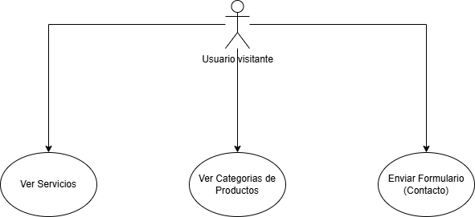

 

 
 

El diagrama de **casos de uso** representa las funcionalidades básicas disponibles para cualquier usuario no registrado (visitante) en la plataforma. El visitante puede ver los servicios ofrecidos, explorar las categorías de productos, y enviar un formulario de contacto. Estas acciones están disponibles sin necesidad de autenticarse en el sistema.