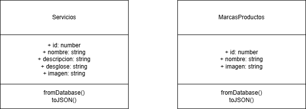

 

 
 

El **diagrama de clases** representa la estructura de los datos manejados por la aplicación para dos entidades principales: **Servicios** y **MarcasProductos**. Ambas clases incluyen atributos públicos y métodos para facilitar la manipulación de datos, especialmente en operaciones relacionadas con bases de datos y conversión a formato JSON.