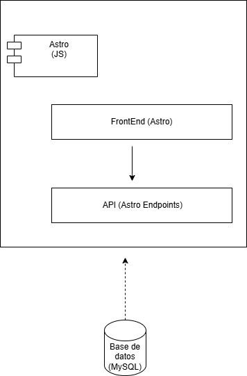

 

 
 

El **diagrama de componentes** representa la arquitectura de una aplicación construida con Astro, organizada en tres niveles principales: **FrontEnd**, **API** y **Base de Datos**. El FrontEnd se encarga de la interfaz de usuario y se comunica con la API a través de Astro Endpoints, que funcionan como intermediarios para gestionar las peticiones. Finalmente, la API establece la conexión con una base de datos MySQL para almacenar y recuperar información. Todo el sistema está desarrollado dentro del entorno de **Astro** utilizando JavaScript.