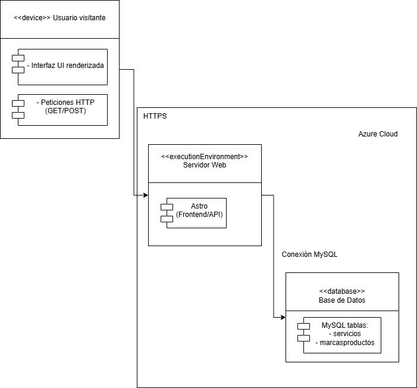

 

 
 

El **diagrama de despliegue** representa la infraestructura de la aplicación y su distribución en entorno de producción. Un usuario visitante interactúa desde su dispositivo a través de una interfaz UI renderizada, realizando peticiones HTTP (GET/POST) a un servidor web alojado en **Azure Cloud**. Este servidor ejecuta **Astro**, que integra tanto el FrontEnd como la API, gestionando las peticiones y respuestas. A su vez, Astro establece una conexión con una base de datos **MySQL**, donde se almacenan las tablas servicios y marcasproductos, permitiendo la persistencia y consulta de los datos.