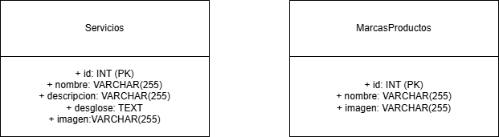

 

 
 

El **diagrama entidad-relación** representa la estructura de los datos gestionados por la aplicación, compuesta por dos entidades principales: **Servicios** y **MarcasProductos**. Cada entidad contiene atributos públicos que permiten almacenar información relevante. Servicios incluye identificador, nombre, descripción, desglose y una imagen asociada, mientras que MarcasProductos contiene un identificador, nombre e imagen. Ambas entidades utilizan un atributo id como clave primaria para garantizar la unicidad de sus registros en la base de datos.