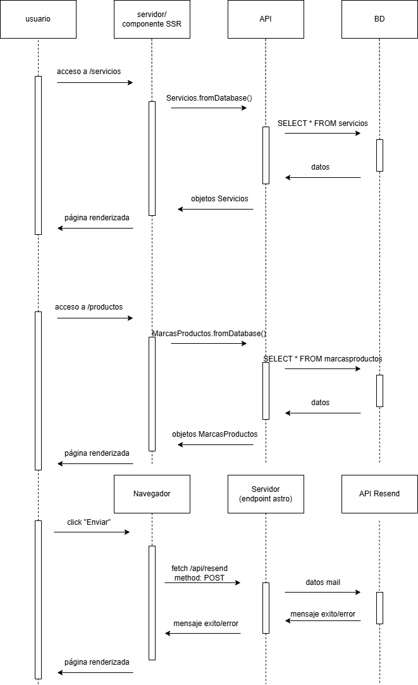

 

 
 

El **diagrama de secuencias** representa el flujo de interacción entre usuario, servidor, API y base de datos durante distintas operaciones de la aplicación. Muestra cómo, al acceder a las rutas /servicios y /productos, el servidor ejecuta métodos para obtener datos desde la base de datos a través de la API y devuelve los objetos correspondientes para renderizar las páginas. Además, se describe el proceso al enviar un formulario, donde el navegador realiza una petición POST al endpoint /api/resend, el servidor envía los datos a una API externa de Resend, y finalmente retorna un mensaje de éxito o error al usuario.